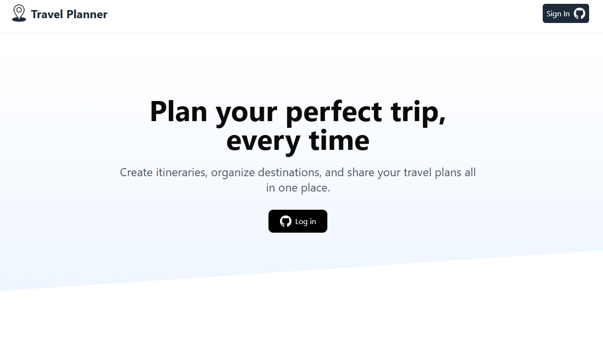

# Travel Planner Application

This is a project to build a FullStack Travel Planner App With NextJS, Google Maps, PostgreSQL (Neon Postgres)

## 🚀 Features

- A beautiful landing page

- User dashboard to create, edit, and manage trip and its itinerary

- User dashboard to track trip itinerary

- Course Structure with Drag & Drop

- Neon Postgres DB

- Prisma ORM

## 🛠️ Tech Stack

- Framework: [Next.js](https://nextjs.org/)
- Styling: Tailwind CSS
- Deployment: Vercel
- Database: Neon Postgres

## 🔗 Live Site

[View Live Portfolio](https://travel-planner-nextjs.vercel.app/)

## 📸 Screenshots

## 📬 Contact

Feel free to connect with me:

- **LinkedIn**: https://www.linkedin.com/in/justintay05/
- **Email**: justin.tys@hotmail.com

---

Built with ❤️ using Next.js
